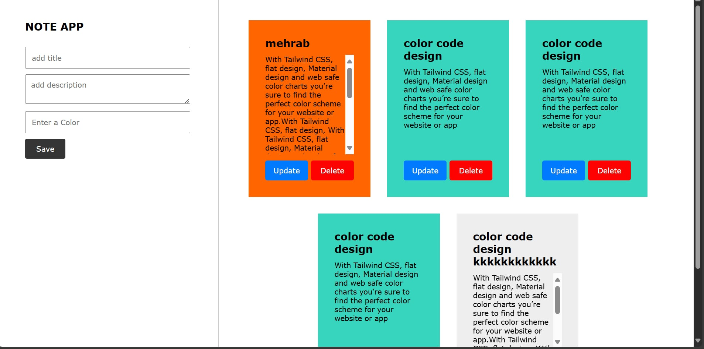

 # 📝 Note App

A simple **Note Taking App** built with **HTML, CSS, JavaScript, and a Web API (ASP.NET Core)**.  
Users can create, update, delete, and customize notes with different colors.  
All notes are managed via a backend **RESTful API**.

---

## 🚀 Features
- Add a note with **title, description, and color** 🎨  
- Edit / Update existing notes ✏️  
- Delete notes ❌  
- Notes data comes from a **Web API** (not just local storage)  
- Responsive card layout 📱  
- Lightweight frontend 

---

## 📸 Screenshot


---

## ⚡ How to Run

### Frontend (HTML, CSS, JS)
1. Clone the repository:
   ```bash
   git clone https://github.com/your-username/note-app.git
